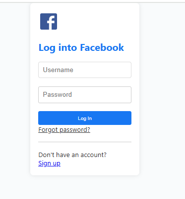

# 🔵 Facebook-Inspired Social Media Platform – Reinvented

An ambitious, full-stack social media web application that *reimagines* how users connect, interact, and share moments online.

Built as a powerful clone of Facebook – but better 😎  
This platform combines modern web technologies with thoughtful design and intelligent backend architecture to deliver a real-time, engaging, and safe social experience.

Note: The server is in the repository: "fooServer"
---

## ✨ Key Highlights

- 👥 **Real-Time Social Interaction:**  
  Friend requests, live notifications, and a seamless chat system – enabling real-time engagement across the platform.

- 📝 **Rich Post Management:**  
  Create, edit, and delete posts. Attach images, tag friends, and express yourself freely.

- 🚨 **Smart Content Moderation:**  
  Automatic filtering and flagging of inappropriate content using keyword-based detection and moderation logic.

- 📡 **Live Feed with WebSocket Magic:**  
  Posts, likes, and comments appear in real time – no refresh needed!

- 🔒 **Secure User Authentication:**  
  With hashed passwords and session/token management – security comes first.

- 🔍 **Personalized Feed & Search:**  
  Users can search posts, explore profiles, and receive a feed curated by relevance and connections.

- 🎨 **Sleek, Responsive UI:**  
  Designed with user experience in mind – works flawlessly across mobile and desktop devices.

---

## 🧠 Built With

**Frontend:**  
- React.js  
- JavaScript  
- CSS Modules / Styled Components  

**Backend:**  
- Node.js + Express  
- MongoDB + Mongoose  
- WebSockets (Socket.IO)  
- Python scripts for backend processing and moderation

---

## 📸 Screenshots

 LogIn| Profile Page |  Feed Page |  Feed Page | Friend Feed |
|||  |  |  |

