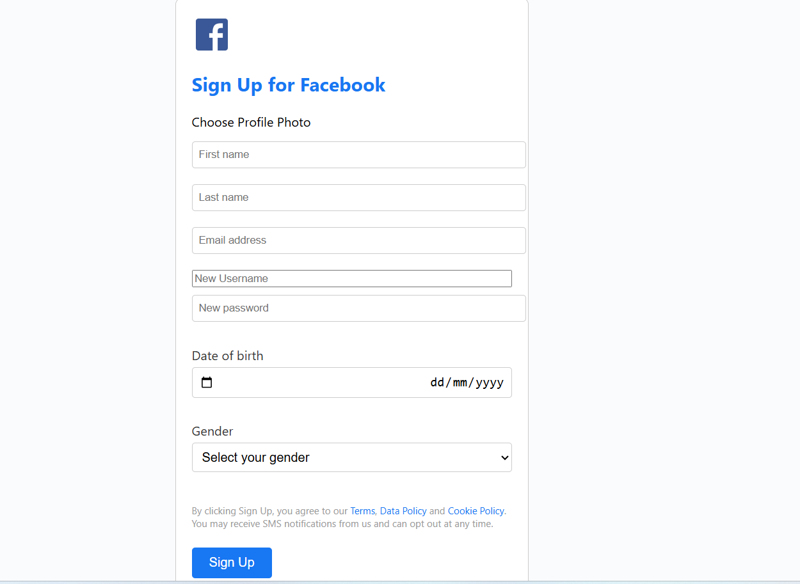
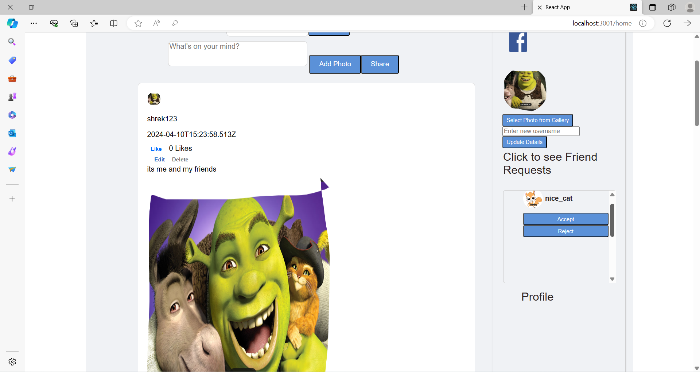
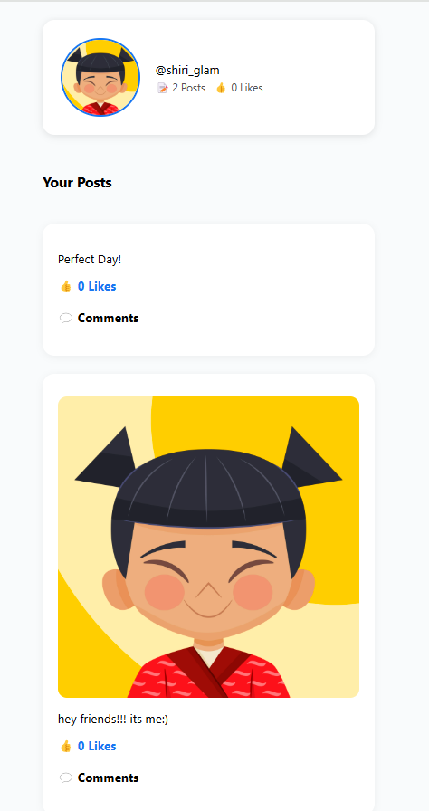

# 🔵 Facebook-Inspired Social Media Platform – Reinvented

An ambitious, full-stack social media web application that *reimagines* how users connect, interact, and share moments online.

Built as a powerful clone of Facebook – but better 😎  
This platform combines modern web technologies with thoughtful design and intelligent backend architecture to deliver a real-time, engaging, and safe social experience.

---

## ✨ Key Highlights

- 👥 **Real-Time Social Interaction:**  
  Friend requests, live notifications, and a seamless chat system – enabling real-time engagement across the platform.

- 📝 **Rich Post Management:**  
  Create, edit, and delete posts. Attach images, tag friends, and express yourself freely.

- 🚨 **Smart Content Moderation:**  
  Automatic filtering and flagging of inappropriate content using keyword-based detection and moderation logic.

- 📡 **Live Feed with WebSocket Magic:**  
  Posts, likes, and comments appear in real time – no refresh needed!

- 🔒 **Secure User Authentication:**  
  With hashed passwords and session/token management – security comes first.

- 🔍 **Personalized Feed & Search:**  
  Users can search posts, explore profiles, and receive a feed curated by relevance and connections.

- 🎨 **Sleek, Responsive UI:**  
  Designed with user experience in mind – works flawlessly across mobile and desktop devices.

---

## 🧠 Built With

**Frontend:**  
- React.js  
- JavaScript  
- CSS Modules / Styled Components  

**Backend:**  
- Node.js + Express  
- MongoDB + Mongoose  
- WebSockets (Socket.IO)  
- Python scripts for backend processing and moderation

---

## 📸 Screenshots

| Sign Up| Profile Page |  Feed Page |  Feed Page | Friend Feed |
|-----------|--------------|
|  |  ||  |

> You can also embed a video demo or GIF using Loom or GIFCapture!

---

## 📂 Architecture Overview

```text
Client (React) → REST APIs & WebSocket → Node.js Backend → MongoDB
                            ↑
                 Python Scripts for Content Moderation
=======
first, we write htmls for the screens and build basic logic for the application... and after I transferred all the code to the structure of react application, build the components and continue to develop the application and added the required features, mainly work on the home page and switching between the screens, the login page and the registration page.
also wrote tests for the home page and tests for the login page. A total of 6 tests.
# run the code:
In order to run the code: npm install npm start
But with the server, we just want to open in the browser "http://localhost:3001"
# run the tests:
In order to run the tests: npm test
# Capabilities of the web application:
 You can request a friend from any user by the button on his post, after which the user from whom we asked for friends can see the list of all friend requests that have asked him by clicking on "friend requests". 
 * for example:

 
 

 * When you click on "Friends" above, you can see the list of all members. for example:
  
  
* And when we click on a friend, you can see all of their posts. for example:
   
   
* The search button also works and you can search for users and when we find a user you can ask him for a friend, if he is already a friend, you will be able to see his posts. for example:
   

